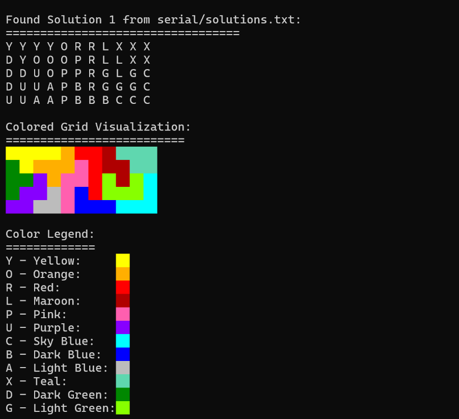

# IQ Fit Puzzle Solver

This project provides a high-performance solver for the IQ Fit puzzle, implemented in both **serial** and **parallel** versions using MPI. The solver finds all **4,331,140 solutions** to the puzzle and includes a visualization tool for inspecting individual solutions.

## 🧩 Puzzle Pieces

The IQ Fit puzzle consists of 12 unique pieces that must be placed on a 5x11 grid:


## 🚀 Implementation Approach

The solver uses an optimized backtracking algorithm with several key techniques:

**Core Algorithm:**

-  **Depth-First Search (DFS)** with pruning heuristics to explore all possible piece placements
-  **Bitwise operations** for efficient board state representation (64-bit masks)
-  **Orphan detection** - pruning branches when isolated 1x1 cells are created
-  **Symmetry handling** - generates and eliminates symmetric duplicates
-  **Pre-computed neighbor masks** for fast orphan detection
-  **Placement indexing** by board cells for efficient iteration

**Serial Implementation:**

-  Single-threaded backtracking

**Parallel Implementation (MPI):**

-  **Work distribution** - divides initial piece placements among processes
-  **Independent search** - each process explores a subset of the search space

## 📸 Sample Solution Output



## ⚡ Performance Results

Based on experimental testing, the parallel implementation shows significant performance improvements:

| Processes | Runtime (s) | Speedup | Efficiency |
| --------- | ----------- | ------- | ---------- |
| Serial    | 729.70      | -       | -          |
| 2         | 438.03      | 1.67    | 0.83       |
| 4         | 229.99      | 3.17    | 0.79       |
| 8         | 157.81      | 4.62    | 0.58       |
| 16        | 136.31      | 5.35    | 0.33       |
| 32        | 108.75      | 6.71    | 0.21       |
| 64        | 100.63      | 7.25    | 0.11       |
| 128       | 98.24       | 7.43    | 0.06       |
| 256       | 93.32       | 7.82    | 0.03       |
| 512       | 88.40       | 8.25    | 0.02       |
| 1024      | 93.65       | 7.79    | 0.01       |

The parallel implementation achieves optimal speedup with 512 processes (8.25x speedup), though efficiency decreases as the number of processes increases due to communication overhead and diminishing returns from work distribution.

## 📋 Dependencies

### For Serial Version

-  **GCC compiler** with C11 support
-  Standard C library

### For Parallel Version (Windows)

-  **Microsoft Visual Studio** (2019 Community or 2022 Community)
   -  Available at: https://visualstudio.microsoft.com/downloads/
   -  Ensure C/C++ development tools are installed
-  **Microsoft MPI (MS-MPI) SDK**
   -  Download from: https://www.microsoft.com/en-us/download/details.aspx?id=57467
   -  Required for MPI header files and libraries

### For Visualization Tool

-  **GCC compiler** with C99 support
-  Standard C library

## 🔧 Build and Run Instructions

### Serial Version

Go to `serial` folder:

```bash
cd serial
```

Compile using:

```bash
gcc -O3 -march=native -flto -pipe -std=c11 iq_serial.c init.c -o iq_serial
```

Run with:

```bash
./iq_serial
```

### Parallel Version

Go to `mpi` folder:

```bash
cd mpi
```

Compile using:

```bash
build.bat
```

Run with:

```bash
mpiexec -n <number_of_processes> iq_mpi.exe
```

### Visualization Tool

Compile using:

```bash
gcc -Wall -Wextra -std=c99 vis.c -o vis
```

Run with:

```bash
./vis <source> <solution_index>
```

**Arguments:**

-  `<source>`: Defines which solutions file to read from.
   -  `s`: Use `serial/solutions.txt`
   -  `m`: Use `mpi/solutions.txt`
-  `<solution_index>`: The index of the solution to be viewed.

## 📁 Output Files

-  `solutions.txt` — Final merged list of all unique solutions
-  `solutions.idx` — Index file generated for visualization (if ./vis executed)

## ⚠️ Notes

-  The visualization tool (`./vis`) creates an index file (`solutions.idx`) for fast, direct access to solution data within `solutions.txt`.
-  This index is generated automatically on the first run. If `solutions.txt` is modified or regenerated, the index will be updated on the next execution of the visualizer to ensure it is not outdated.
-  The `build.bat` script assumes that Visual Studio and MS-MPI are installed in their standard locations. If compilation fails, the paths within the script may need to be updated, or the pre-built `iq_mpi.exe` binary can be used.
